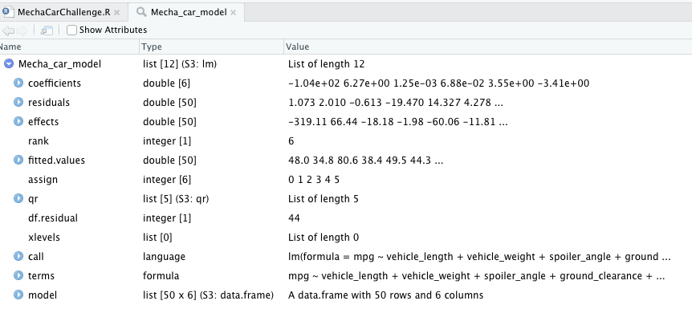
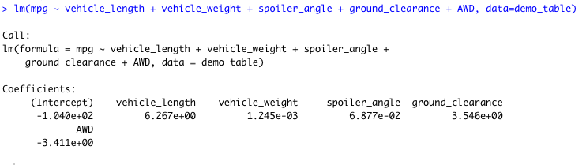
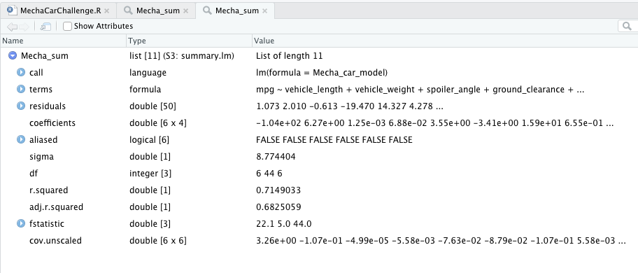
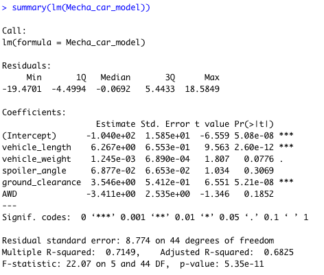
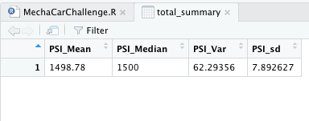
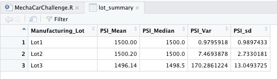
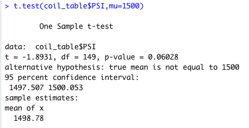
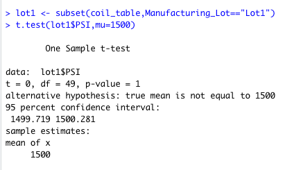
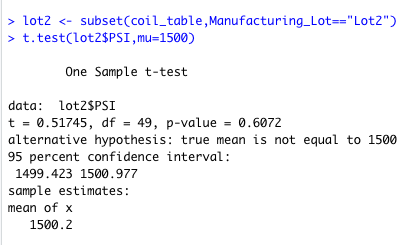
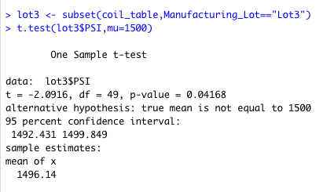

# MechaCar_Statistical_Analysis

## Linear Regression to Predict MPG
DELIVERABLE 1

Which variables/coefficients provided a non-random amount of variance to the mpg values in the dataset?
The vehicle weight and spoiler angles are variables that are non random affecting MPG.

## Summary Statistics on Suspension Coils
DELIVERABLE 2

The design specifications for the MechaCar suspension coils dictate that the variance of the suspension coils must not exceed 100 pounds. The current manufacturing data specification for all manufacturing lots in total show that the specifications have are being met, however when broken down by lot we can see lot3 exceeds the max psi specs.

## T-Tests on Suspension Coils
DELIVERABLE 3

briefly summarize your interpretation and findings for the t-test results. Include screenshots of the t-test to support your summary.

## Study Design: MechaCar vs Competition
DELIVERABLE 4
Write a short description of a statistical study that can quantify how the MechaCar performs against the competition. In your study design, think critically about what metrics would be of interest to a consumer: for a few examples, cost, city or highway fuel efficiency, horse power, maintenance cost, or safety rating.
In your description, address the following questions:
What metric or metrics are you going to test?
What is the null hypothesis or alternative hypothesis?
What statistical test would you use to test the hypothesis? And why?
What data is needed to run the statistical test?

