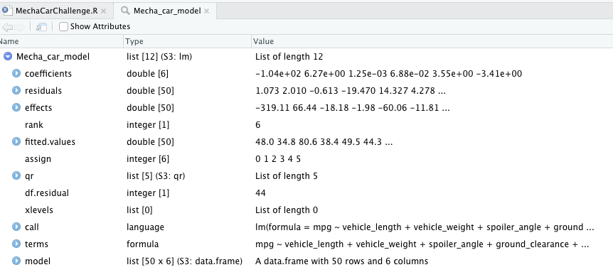
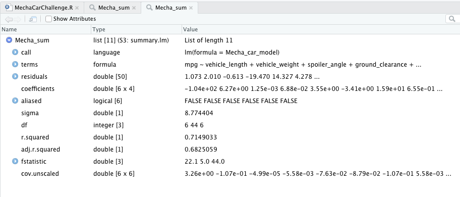
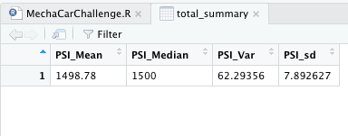
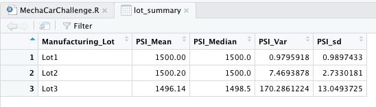
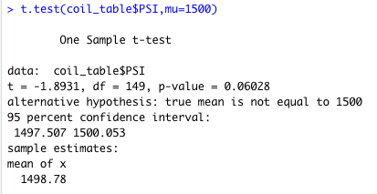
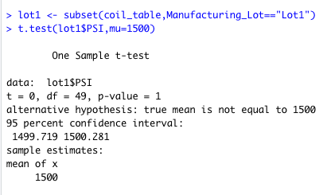
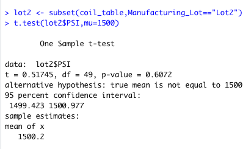
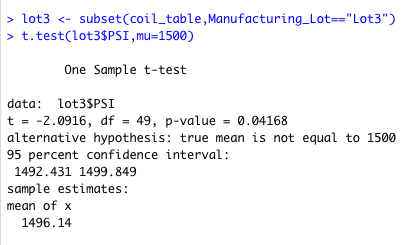

# MechaCar_Statistical_Analysis

## Linear Regression to Predict MPG

   
   

Which variables/coefficients provided a non-random amount of variance to the mpg values in the dataset?
The vehicle weight and spoiler angles are variables that are non random affecting MPG.

## Summary Statistics on Suspension Coils

The design specifications for the MechaCar suspension coils dictate that the variance of the suspension coils must not exceed 100 pounds. The current manufacturing data specification for all manufacturing lots in total show that the specifications are being met, however when broken down by lot we can see lot exceeds the max psi specs.

## T-Tests on Suspension Coils

The t-test results of the coil table, and lots 1-2 are consistent not exceeding the the true mean of 1500 all with 95% accuracy. The t-test of lot 3 however exceeds the true mean.

## Study Design: MechaCar vs Competition

When considering MechaCar vs the Competition we would need the same metrics as the metrics used to analyze MechaCar to maintain accuracy. With the same data metrics we could run similar t-tests on the metrics indivially or one could do a two sample t-test or an anova. Some other tests that could determind consumer preference based on other priorites instead of saftey or fuel efficiency woiuld be cost to purchase and costs to mainatain.

